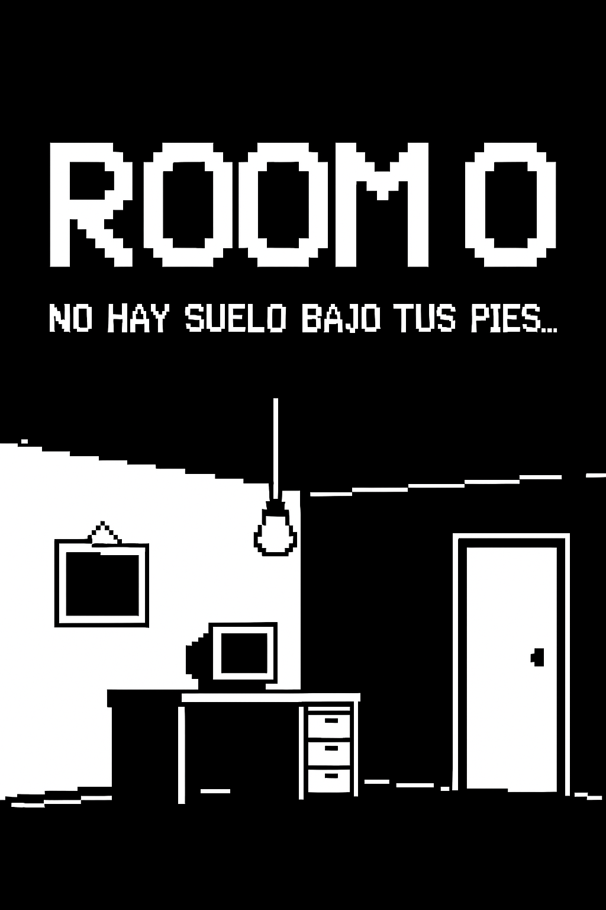

# 🕹️ room_0 





### Demo online

https://room0.netlify.app/

---
### ¿Cómo jugar en local?

1. Abrir `index.html`
2. Pulsa el botón `Interruptor`
3. Explorá la habitación: clics, códigos, pistas, reflexiones...

---

### Tecnologías

- HTML / CSS
- JavaScript 
- Visual Studio Code
- Pixel art + sonidos retro
- Netlify para hosting

---

### Instalación local

```bash
git clone https://github.com/S1371582/room_0.git
cd room_0
code .
```

### © Autor
Creado por S1371582

