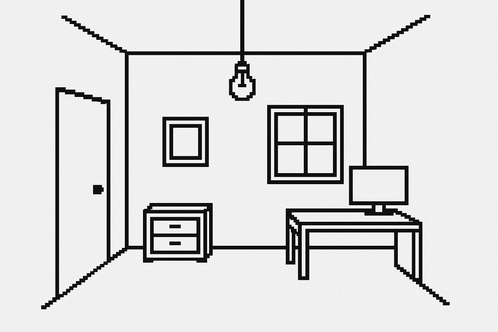

# 🕹️ room_0 

Room 0 es una aventura gráfica experimental e interactiva en blanco y negro, construida a partir de símbolos, ecos y fragmentos.
Despiertas en una habitación que no recuerdas. Cada objeto parece tener una intención. Nada es exactamente lo que ves. ¿Estás soñando? ¿O alguien más está soñando por ti?
Explorá, tocá, enciende, apaga. Revela mensajes ocultos, zonas sensibles al cursor, y accede a fragmentos de identidad que parecen venir de otro tú.

Esta experiencia se desarrolla enteramente en HTML, CSS y JavaScript.



### Demo online

https://room0.netlify.app/

---
### ¿Cómo jugar en local?

1. Abrir `index.html`
2. Pulsa el botón `Interruptor`
3. Explorá la habitación: clics, códigos, pistas, reflexiones...

---

### Tecnologías

- HTML / CSS
- JavaScript 
- Visual Studio Code
- Pixel art + sonidos retro
- Netlify para hosting

---

### Instalación local

```bash
git clone https://github.com/S1371582/room_0.git
cd room_0
code .
```

### © Autor
Creado por S1371582

